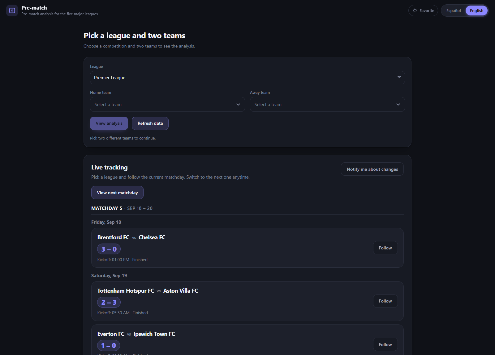
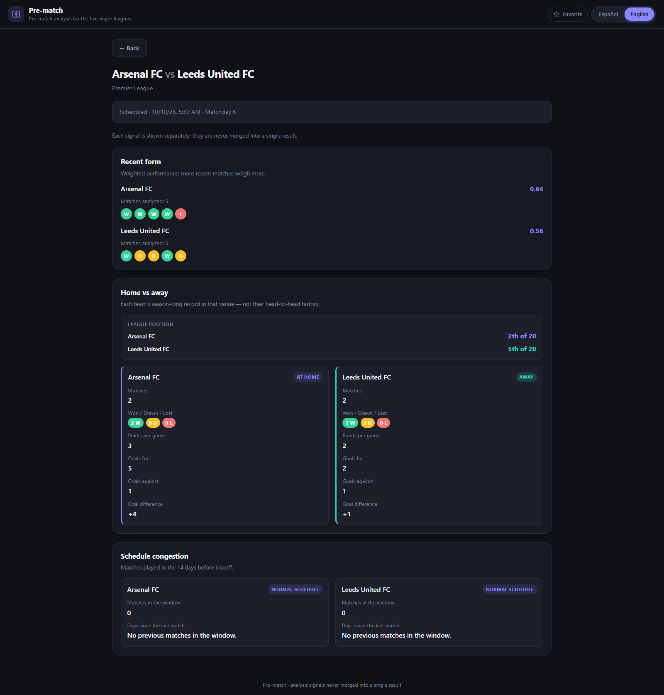
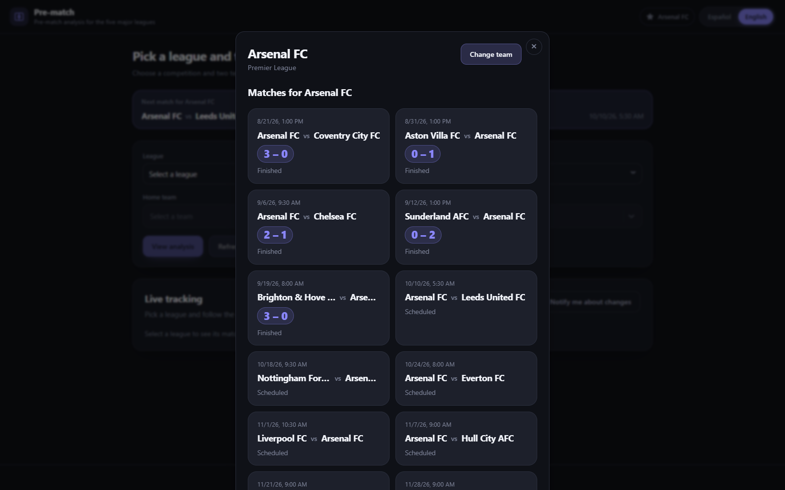

# Pre-match

**[English](README.md) | [Español](README.es.md)**

<p align="center">
  
</p>

Pre-match es una herramienta local de un solo usuario que convierte el historial de partidos de una
liga en un conjunto reducido de **señales de contexto que interpreta una persona** — no en un volcado
de estadísticas crudas. Cubre las cinco grandes ligas domésticas — Premier League (`PL`), La Liga (`PD`),
Bundesliga (`BL1`), Serie A (`SA`) y Ligue 1 (`FL1`) — y se centra en la pregunta que cualquier aficionado se hace antes del
pitido inicial: ¿con qué llega cada equipo a este partido?

Funciona **sin autenticación**: no hay cuentas ni estado de servidor por usuario. Todo lo que debe
sobrevivir a una recarga — el idioma, el equipo favorito, los partidos seguidos — vive en el
navegador. El backend guarda el historial de partidos en SQLite, cachea las respuestas en bruto de
football-data.org con un TTL y empuja los cambios de marcador y estado por Socket.io, consultando la
API externa solo mientras un partido está realmente en juego.

## Requisitos

- Node.js (LTS).
- [pnpm](https://pnpm.io/) `11.3.0` (fijado vía `packageManager` en `package.json`).
- Una API key gratuita de [football-data.org](https://www.football-data.org/) — **opcional**. Sin
  ella, el servidor genera un dataset de demostración de la Premier League en el primer arranque (un
  aviso en la UI lo deja claro), así siempre hay algo para explorar. Con ella, sincronizar y el
  polling en vivo traen datos reales, y cualquier resto de datos demo se elimina solo.
- [Docker](https://docs.docker.com/get-docker/) (opcional) para ejecutar la imagen empaquetada en un
  solo contenedor.

## Compilar, probar y ejecutar

```bash
# 1. Instala las dependencias de ambos paquetes
pnpm install

# 2. Ejecuta la API y el cliente juntos en desarrollo
pnpm dev
```

`pnpm dev` levanta ambos procesos a la vez: la API en `http://localhost:3000` y el cliente en
`http://localhost:5173`. Usa `concurrently -k`, así que cuando un proceso termina el otro también se
detiene. Usa `pnpm dev:server` o `pnpm dev:client` para arrancar solo uno de ellos.

No hace falta ninguna `FOOTBALL_DATA_API_KEY` para esto: sin una configurada, el servidor siembra un
dataset de demostración de la Premier League (resultados pasados, un partido en vivo y una jornada
próxima) la primera vez que arranca contra una base vacía, y el explorador muestra un aviso al
respecto. Para sincronizar datos reales de football-data.org en su lugar:

```bash
# Los scripts corren con cwd en server/, así que dotenv lee server/.env, no el .env de la raíz
cp server/.env.example server/.env
# edita server/.env, define FOOTBALL_DATA_API_KEY y reiniciá pnpm dev
```

Reiniciar con una key configurada elimina los datos demo automáticamente; elegí una liga en el
explorador y tocá "Actualizar datos" (o `POST /api/sync/:league`) para poblarla de verdad.

| Comando | Descripción |
| --- | --- |
| `pnpm dev` | Arranca la API y el cliente juntos. |
| `pnpm dev:server` / `pnpm dev:client` | Arranca solo la API (modo watch) o solo el cliente. |
| `pnpm test` | Ejecuta los tests del servidor. |
| `pnpm --filter client test` | Ejecuta los tests del cliente. |
| `pnpm lint` | Ejecuta el lint en todos los paquetes. |

### Docker

Toda la app también se ejecuta como **un solo contenedor**: Express sirve el cliente React ya
compilado, así que no hay Nginx, y la base SQLite vive en un volumen nombrado para sobrevivir a los
reinicios.

```bash
# 1. Crea el fichero de entorno que lee Compose (está en .gitignore)
cp .env.example .env

# 2. Compila la imagen y arranca la app
docker compose up --build
```

La app queda en `http://localhost:${PORT}` (`3000` por defecto). Las migraciones se ejecutan
automáticamente al arrancar, y sin `FOOTBALL_DATA_API_KEY` definida en `.env` un volumen nuevo siembra
el mismo dataset de demostración de la Premier League descrito arriba — nada más que hacer, el
explorador queda poblado enseguida. Para sincronizar datos reales en su lugar, editá `.env`, definí
`FOOTBALL_DATA_API_KEY` y reiniciá; los datos demo se eliminan solos, y "Actualizar datos" por liga en
el explorador (o `POST /api/sync/:league`) los puebla de verdad.

| Comando | Descripción |
| --- | --- |
| `docker compose up --build` | Compila la imagen y ejecuta la API más el build del cliente en `PORT`. |
| `docker compose down` | Detiene el contenedor; el volumen SQLite se conserva. |
| `docker compose down -v` | Detiene el contenedor y borra la base de datos guardada. |

## Capturas de pantalla

| Explorador | Análisis | Equipo favorito |
| --- | --- | --- |
|  |  |  |

### Explorador

Elige una liga y dos equipos. La liga usa un select nativo y ambos equipos usan un selector
buscable (`react-select`), así que una lista larga de equipos se puede filtrar escribiendo, con
soporte completo de teclado y lectores de pantalla. Debajo del formulario, el panel en vivo lista la
**jornada actual** de la liga — la última que ya empezó, de modo que se ven sus partidos jugados, en
directo y pendientes — con un botón para pasar a la jornada siguiente. Los partidos se agrupan por
día natural y se ordenan por hora de inicio, y se pueden seguir tantos como se quiera.

### Análisis

La vista de análisis muestra las tres señales como **tarjetas separadas** y nunca las fusiona en un
único resultado: **Forma reciente** (ponderada con decaimiento exponencial, los partidos más
recientes pesan más), **Local vs visitante** (el registro de cada equipo en la temporada en la sede
donde se juega este partido, con su posición en la tabla) y **Congestión de calendario** (partidos
jugados en los 14 días previos al pitido inicial). Un banner en la parte superior muestra el
**partido real** que el backend resolvió entre los dos equipos — su estado, fecha y jornada, o un
mensaje claro cuando no hay ningún enfrentamiento registrado.

### Equipo favorito

Guarda un equipo favorito y te acompaña en todas partes. El modal lista todos los partidos
guardados de ese equipo, jugados y pendientes, como una cuadrícula de tarjetas, con un botón
**Cambiar de equipo** que reabre los selectores ya rellenados. El explorador muestra un banner
compacto con el partido en directo o siguiente del equipo, y un observador en segundo plano se
suscribe automáticamente a ese partido, de modo que sus actualizaciones suenan (y muestran una
notificación de escritorio opcional) sin tener que seguirlo a mano.

## Arquitectura

El servidor mantiene un flujo de petición estricto — `routes/` → `controllers/` → `services/` →
`repositories/` — de modo que solo los repositorios tocan SQL y solo `external/` habla con
football-data.org. El cliente refleja esa disciplina: los componentes nunca llaman a `fetch` ni a
`socket.io-client` directamente, las páginas orquestan los hooks, los hooks consumen los servicios y
los servicios construyen las peticiones.

| Proyecto | Stack | Propósito |
| --- | --- | --- |
| `server` | Node.js, Express, better-sqlite3, Socket.io, Zod, Vitest + Supertest | API REST, historial y caché en SQLite, cliente de football-data.org con rate limiter, el motor de análisis de tres señales y el poller y los sockets de actualizaciones en vivo. |
| `client` | React 19, Vite 8, i18next, socket.io-client, Vitest + Testing Library | UI web responsive y bilingüe: explorador, tarjetas de análisis, panel en vivo, equipo favorito. |
| Herramientas | pnpm workspaces, Vitest, Oxlint | Una sola instalación para ambos paquetes, un runner de tests por paquete y un linter rápido. |

El diagrama de arquitectura completo, los diagramas de secuencia (sync, motor de análisis,
actualizaciones en vivo, equipo favorito) y todas las capturas de esta página viven en
[`docs/diagrams`](docs/diagrams/README.es.md) y [`docs/images`](docs/images).

## Decisiones técnicas

| Decisión | Elección | Por qué |
| --- | --- | --- |
| Lenguaje | JavaScript puro (ESM + JSX), sin TypeScript | Mantiene el proyecto pequeño y ligero en dependencias. Zod valida cada frontera y JSDoc documenta las firmas, suficiente para un código de este tamaño. |
| Persistencia | SQLite con dos responsabilidades separadas: historial duradero en `teams` / `matches` y `api_cache` efímera con TTL | Una caché obsoleta nunca puede convertirse en la fuente de verdad, y el historial duradero es lo que lee el motor de análisis. |
| Salida del análisis | Tres señales devueltas una al lado de otra, nunca fusionadas | La herramienta informa el juicio humano; fusionarlas ocultaría cuándo discrepan e implicaría una predicción que no puede hacer. |
| Driver de SQLite | `better-sqlite3` | Síncrono, rápido y transaccional, sin ceremonia asíncrona para consultas locales simples. |
| Tiempo real | Socket.io más polling acotado a la ventana en vivo | Los WebSockets empujan actualizaciones a salas por partido, y el servidor solo llama a football-data.org mientras un partido guardado está realmente en juego, manteniéndose dentro del límite del plan gratuito. |
| Organización del repositorio | pnpm workspaces (`server`, `client`) | Una sola instalación y scripts compartidos en la raíz, mientras cada paquete sigue siendo ejecutable y testeable por separado. |
| i18n | i18next con ambos idiomas importados de forma estática y la elección persistida en `localStorage` | El cambio es instantáneo y síncrono (sin fetch, sin Suspense), y la preferencia sobrevive a una recarga. |
| Diseño responsive | CSS mobile-first | El explorador y el análisis se usan en el móvil; las tarjetas de señales, el panel en vivo y el modal se reacomodan en lugar de desbordarse. |
| Head-to-head | Retirado como señal | Casi nunca tenía datos suficientes, y el endpoint externo entre temporadas no era lo bastante fiable para mostrarlo como un hecho. Ver [`docs/scope.es.md`](docs/scope.es.md). |
| Goleadores y tarjetas | No se muestran | Los endpoints de football-data.org que consume el backend no los proporcionan, así que no hay de dónde derivarlos. |

## Estructura del proyecto

```text
pre-match/
├── Dockerfile                       # Build multi-stage: build del cliente + runtime de Express
├── docker-compose.yml               # Un servicio, puerto publicado y volumen SQLite persistente
├── server/                          # API en Express (Node.js, ESM)
│   └── src/
│       ├── server.js                # Punto de entrada: servidor HTTP + Socket.io + poller en vivo
│       ├── app.js                   # Construye la app de Express (middleware + rutas)
│       ├── config/env.js            # Configuración de entorno centralizada
│       ├── routes/                  # health, teams, matches, sync, analysis
│       ├── controllers/             # Valida la petición y da forma a la respuesta
│       ├── services/
│       │   ├── sync.service.js      # Sincronización caché-o-API hacia SQLite
│       │   ├── livePoller.service.js# Sondea solo los partidos dentro de su ventana en vivo
│       │   ├── demoSeed.service.js  # Genera/purga el dataset de demostración
│       │   └── analysisEngine/      # form, homeAway, schedule, fixture, standings
│       ├── repositories/            # teams, matches, cache (el único SQL)
│       ├── db/                      # Conexión perezosa + runner de migraciones y 001_init.sql
│       ├── external/                # Cliente de football-data.org + rate limiter
│       ├── schemas/                 # Zod: league, team, match, analysis, externalApi
│       └── sockets/                 # liveMatches (salas + match:update)
└── client/                          # React 19 + Vite 8
    └── src/
        ├── main.jsx                 # Inicializa i18n y monta <App />
        ├── App.jsx                  # Shell, rutas, modal de favorito + observador en vivo
        ├── pages/                   # ExplorerPage, AnalysisPage
        ├── components/              # Tarjetas de señales, panel en vivo, modal y banner de favorito
        ├── hooks/                   # Hooks de datos + el contexto del equipo favorito
        ├── services/                # Envoltorios puros de fetch / socket
        ├── i18n/                    # Config de i18next + bundles es/en
        ├── utils/                   # Agrupación por jornada, formato de fechas, helpers
        └── constants/               # Ligas soportadas, estados en vivo
```

Cada paquete tiene su propio README con la referencia de la API y los detalles del cliente:
[`server/README.es.md`](server/README.es.md) y [`client/README.es.md`](client/README.es.md).

## Pruebas

Vitest ejecuta ambas suites. Los tests viven en carpetas `__tests__/` junto a cada módulo, con
fixtures compartidos en la carpeta `test/` de cada paquete.

- **`server` — 131 tests en 20 ficheros:** los repositorios contra un fichero SQLite desechable, las
  señales del motor de análisis y la resolución del partido, el servicio de sincronización, el
  generador y la purga del dataset de demostración, el poller en vivo con temporizadores falsos, los
  handlers de Socket.io, el rate limiter y las rutas de Express con Supertest.
- **`client` — 143 tests en 30 ficheros:** componentes, hooks, servicios, i18n y los flujos de
  extremo a extremo (liga → equipos → las tres tarjetas de análisis; seguir un partido y recibir una
  actualización en vivo sin refetch; cambio de idioma; y el modal de equipo favorito, incluido el
  flujo de volver al modal).

```bash
pnpm test                    # servidor
pnpm --filter client test    # cliente
```

## Estado

Todas las fases del plan están completas: la funcionalidad de la aplicación (fases 1-5 y 8) está
cubierta por las suites de tests, y la fase 7 empaqueta toda la app como una sola imagen Docker.

- **Explorador y análisis** funcionan de extremo a extremo: elige una liga y dos equipos, obtén el
  partido real resuelto y las tres señales independientes como tarjetas separadas.
- **Seguimiento en vivo** empuja cambios de marcador y estado por Socket.io, con el poller acotado a
  la ventana en vivo y salas por partido.
- **i18n** cambia entre español e inglés al instante y persiste la elección.
- **Equipo favorito** tiene su modal, su banner en el explorador y auto-seguimiento en vivo.
- **Empaquetado Docker** sirve el cliente compilado desde Express en un solo contenedor, ejecuta las
  migraciones al arrancar y conserva la base SQLite en un volumen nombrado.
- **Dataset de demostración** se siembra solo cuando no hay `FOOTBALL_DATA_API_KEY` configurada, y se
  elimina solo en cuanto hay una real — nunca conviven.

## Licencia

Publicado bajo la [licencia MIT](LICENSE).
