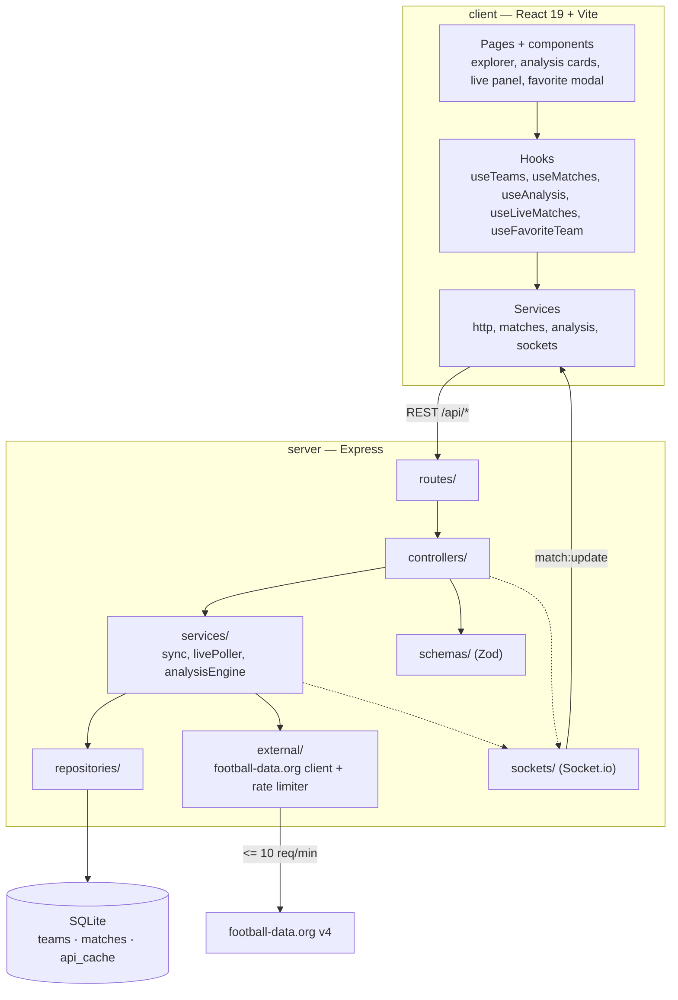

# Pre-match

**[English](README.md) | [Español](README.es.md)**

<p align="center">
  
</p>

Pre-match is a single-user, local tool that turns a football league's stored match history into a
small set of **context signals a human interprets** — not a raw dump of statistics. It covers the
five major domestic leagues — Premier League (`PL`), La Liga (`PD`), Bundesliga (`BL1`), Serie A
(`SA`) and Ligue 1 (`FL1`) — and focuses
on the question a fan actually asks before kickoff: what does each team bring into this game?

It runs **without authentication**: there are no accounts and no per-user server state. Everything
that must survive a reload — language, favorite team, followed matches — lives in the browser. The
backend keeps durable match history in SQLite, caches raw football-data.org payloads with a TTL, and
pushes live score and state changes over Socket.io, polling the external API only while a match is
actually in play.

## Screenshots

| Explorer | Analysis | Favorite team |
| --- | --- | --- |
|  |  |  |

### Explorer

Pick a league and two teams. The league uses a native select and both teams use a searchable
selector (`react-select`), so a long team list can be filtered by typing with full keyboard and
screen-reader support. Below the form, the live panel lists the league's **current matchday** —
the latest one that already started, so its played, live and remaining fixtures are all shown —
with a toggle to the next matchday. Fixtures are grouped by calendar day and ordered by kickoff,
and any number of them can be followed at once.

### Analysis

The analysis view renders the three signals as **separate cards** and never merges them into a
single score: **Recent form** (exponentially weighted, more recent matches weigh more), **Home vs
away** (each team's season record in the venue this game is played in, with its league position) and
**Schedule congestion** (matches played in the 14 days before kickoff). A banner at the top shows the
**real fixture** the backend resolved between the two teams — its status, date and matchday, or a
clear message when the two have no meeting on record.

### Favorite team

Save one favorite team and it follows along everywhere. The modal lists every stored match of that
team, played and upcoming, as a grid of cards, with a **Change team** button that reopens the
selectors pre-filled. The explorer shows a compact banner with the team's live-or-next match, and a
background watcher auto-subscribes to that match, so its updates play a sound (and an opt-in desktop
notification) without following it by hand.

## Architecture



The server keeps a strict request flow — `routes/` → `controllers/` → `services/` →
`repositories/` — so only the repositories touch SQL and only `external/` talks to
football-data.org. The client mirrors that discipline: components never call `fetch` or
`socket.io-client` directly, pages orchestrate hooks, hooks consume services, and services build the
requests.

| Project | Stack | Purpose |
| --- | --- | --- |
| `server` | Node.js, Express, better-sqlite3, Socket.io, Zod, Vitest + Supertest | REST API, SQLite history and cache, football-data.org client with a rate limiter, the three-signal analysis engine and the live-update poller and sockets. |
| `client` | React 19, Vite 8, i18next, socket.io-client, Vitest + Testing Library | Responsive bilingual web UI: explorer, analysis cards, live panel, favorite team. |
| Tooling | pnpm workspaces, Vitest, Oxlint | One install for both packages, a test runner per package and a fast linter. |

### Detailed diagrams

The full set lives in [`docs/diagrams`](docs/diagrams), one Markdown file per diagram:

- [Architecture](docs/diagrams/architecture.md): the layers and their responsibilities.
- [Sync and cache](docs/diagrams/sync-and-cache.md): cache-or-API retrieval, validation and upsert.
- [Analysis engine](docs/diagrams/analysis-engine.md): fixture resolution and the three independent signals.
- [Live updates](docs/diagrams/live-updates.md): Socket.io plus the poller bounded to the live window.
- [Favorite team](docs/diagrams/favorite-team.md): the shared context, the modal and the auto-follow watcher.

## Technical decisions

| Decision | Choice | Why |
| --- | --- | --- |
| Language | Plain JavaScript (ESM + JSX), no TypeScript | Keeps the project small and dependency-light. Zod validates every boundary and JSDoc documents the signatures, which is enough for a codebase this size. |
| Persistence | SQLite with two separated concerns: durable `teams` / `matches` history and an ephemeral `api_cache` with a TTL | A stale cache can never become the source of truth, and the durable history is what the analysis engine reads. |
| Analysis output | Three signals returned side by side, never fused | The tool informs a human judgement; merging the signals would hide when they disagree and imply a prediction it cannot make. |
| SQLite driver | `better-sqlite3` | Synchronous, fast and transactional, with no async ceremony for simple local queries. |
| Real time | Socket.io plus polling bounded to the live window | WebSockets push updates to per-match rooms, and the server only calls football-data.org while a stored match is actually live, staying inside the free-tier rate limit. |
| Repository layout | pnpm workspaces (`server`, `client`) | One install and shared root scripts, while each package stays independently runnable and testable. |
| i18n | i18next with both locale bundles imported statically and the choice persisted in `localStorage` | Switching is instant and synchronous (no fetch, no Suspense), and the preference survives a reload. |
| Responsive design | Mobile-first CSS | The explorer and the analysis are used on phones; signal cards, the live panel and the modal reflow instead of overflowing. |
| Head-to-head | Removed as a signal | It almost never had enough data, and the external cross-season endpoint was not reliable enough to show as fact. See [`docs/scope.md`](docs/scope.md). |
| Goalscorers and cards | Not shown | The football-data.org endpoints the backend consumes do not provide them, so there is nothing to derive them from. |

## Project structure

```text
pre-match/
├── server/                          # Express API (Node.js, ESM)
│   └── src/
│       ├── server.js                # Entry point: HTTP server + Socket.io + live poller
│       ├── app.js                   # Builds the Express app (middleware + routes)
│       ├── config/env.js            # Centralized environment configuration
│       ├── routes/                  # health, teams, matches, sync, analysis
│       ├── controllers/             # Validate the request and shape the response
│       ├── services/
│       │   ├── sync.service.js      # Cache-or-API sync into SQLite
│       │   ├── livePoller.service.js# Polls only matches inside their live window
│       │   └── analysisEngine/      # form, homeAway, schedule, fixture, standings
│       ├── repositories/            # teams, matches, cache (the only SQL)
│       ├── db/                      # Lazy connection + migration runner and 001_init.sql
│       ├── external/                # football-data.org client + rate limiter
│       ├── schemas/                 # Zod: league, team, match, analysis, externalApi
│       └── sockets/                 # liveMatches (rooms + match:update)
└── client/                          # React 19 + Vite 8
    └── src/
        ├── main.jsx                 # Initializes i18n and mounts <App />
        ├── App.jsx                  # Shell, routes, favorite modal + live watcher
        ├── pages/                   # ExplorerPage, AnalysisPage
        ├── components/              # Signal cards, live panel, favorite modal and banner
        ├── hooks/                   # Data hooks + the favorite-team context
        ├── services/                # Pure fetch / socket wrappers
        ├── i18n/                    # i18next config + es/en locale bundles
        ├── utils/                   # Matchday grouping, date formatting, helpers
        └── constants/               # Supported leagues, live statuses
```

Each package has its own README with the API reference and the client details:
[`server/README.md`](server/README.md) and [`client/README.md`](client/README.md).

## Requirements

- Node.js (LTS).
- [pnpm](https://pnpm.io/) `11.3.0` (pinned via `packageManager` in `package.json`).
- A free [football-data.org](https://www.football-data.org/) API key to sync leagues. The app runs
  against data already stored in SQLite without one, but syncing and live polling need it.

## Build, test and run

```bash
# 1. Install dependencies for both packages
pnpm install

# 2. Configure the environment (the scripts run with cwd set to server/, so dotenv reads server/.env)
cp server/.env.example server/.env
# edit server/.env and set FOOTBALL_DATA_API_KEY

# 3. Run the API and the client together in development
pnpm dev
```

`pnpm dev` starts both processes at once: the API on `http://localhost:3000` and the client on
`http://localhost:5173`. It uses `concurrently -k`, so when one process exits the other is stopped
too. Use `pnpm dev:server` or `pnpm dev:client` to run only one of them.

| Command | Description |
| --- | --- |
| `pnpm dev` | Start the API and the client together. |
| `pnpm dev:server` / `pnpm dev:client` | Start only the API (watch mode) or only the client. |
| `pnpm test` | Run the server test suite. |
| `pnpm --filter client test` | Run the client test suite. |
| `pnpm lint` | Lint every package. |

## Testing

Vitest runs both suites. Tests live in `__tests__/` folders next to each module, with shared fixtures
under each package's `test/` folder.

- **`server` — 121 tests across 18 files:** the repositories against a throwaway SQLite file, the
  analysis engine's signals and fixture resolution, the sync service, the live poller under fake
  timers, the Socket.io handlers, the rate limiter and the Express routes with Supertest.
- **`client` — 137 tests across 28 files:** components, hooks, services, i18n and the end-to-end
  flows (league → teams → the three analysis cards; follow a match and receive a live update without
  a refetch; language switching; and the favorite-team modal including the back-to-modal flow).

```bash
pnpm test                    # server
pnpm --filter client test    # client
```

## Status

Phases 1-5 and 8 of the plan are complete and covered by tests. Docker packaging (phase 7) is still
pending.

- **Explorer and analysis** work end to end: pick a league and two teams, get the real resolved
  fixture and the three independent signals as separate cards.
- **Live tracking** pushes score and state changes over Socket.io, with the poller bounded to the
  live window and per-match rooms.
- **i18n** switches between Spanish and English instantly and persists the choice.
- **Favorite team** has its modal, its explorer banner and automatic live following.
- **Pending:** Docker packaging (phase 7).

## License

TBD — _WIP_.
