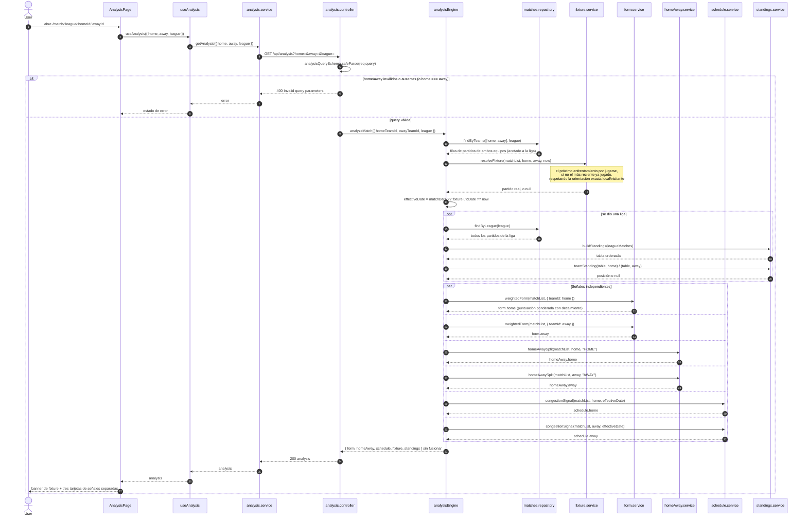

# Motor de análisis

Secuencia de `GET /api/analysis?home=&away=&league=`. El endpoint primero resuelve el partido real
entre los dos equipos (así quien llama no tiene que inventar una fecha) y luego calcula las tres
señales sobre las mismas filas de partidos almacenadas. Las señales se devuelven una al lado de la
otra y nunca se fusionan, se ponderan entre sí ni se reducen a una única puntuación.

Las señales de un vistazo:

| Señal | Módulo | Qué responde | Valores por defecto |
| --- | --- | --- | --- |
| Forma reciente | `form.service.js` | ¿Qué tan bien viene jugando cada equipo? | 5 partidos, decaimiento de 0.7 por partido de antigüedad |
| Local vs visitante | `homeAway.service.js` | ¿Cómo rinde cada equipo en la sede donde se juega este partido? | temporada en curso, sede exacta |
| Congestión de calendario | `schedule.service.js` | ¿Qué tan cargado viene el calendario previo a este pitido inicial? | ventana de 14 días, umbral de 3 partidos |

La vista de análisis también muestra la posición en la tabla de cada equipo (desde
`standings.service.js`) dentro de la tarjeta Local vs visitante, y el banner de fixture muestra el
estado, la fecha y la jornada del partido resuelto.

Cuando a una señal le falta historial suficiente lo dice explícitamente en vez de adivinar:
`form.weightedScore` es `null` con cero partidos analizados, `homeAway` reporta cero partidos, y
`schedule` reporta "sin partidos previos en la ventana". Un enfrentamiento sin ningún cruce
registrado devuelve `fixture: null` y el análisis igual calcula las señales con los partidos que
tenga cada equipo.

Hubo una cuarta señal, historial directo (head-to-head), eliminada porque casi nunca tenía datos
suficientes y el endpoint externo entre temporadas no era lo bastante fiable para mostrarlo como un
hecho (ver [`../scope.es.md`](../scope.es.md)).
