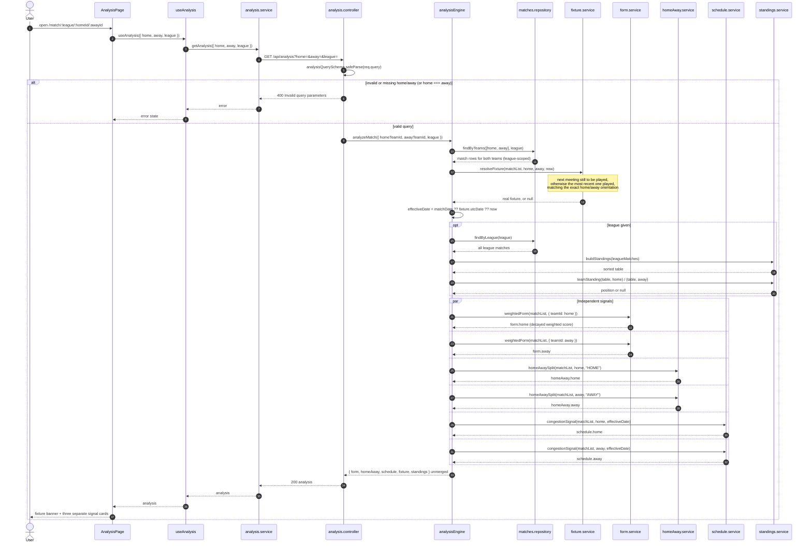

# Analysis engine

Sequence of `GET /api/analysis?home=&away=&league=`. The endpoint first resolves the real fixture
between the two teams (so the caller does not have to invent a date) and then computes the three
signals over the same stored match rows. The signals are returned side by side and are never fused,
weighted against each other or reduced to a single score.

Signals at a glance:

| Signal | Module | What it answers | Defaults |
| --- | --- | --- | --- |
| Recent form | `form.service.js` | How good has each team been lately? | 5 matches, 0.7 decay per match of age |
| Home vs away | `homeAway.service.js` | How does each team perform in the venue this game is played in? | season-to-date, exact venue |
| Schedule congestion | `schedule.service.js` | How heavy is the run-up to this kickoff? | 14-day window, 3-match threshold |

The analysis page also shows each team's league position (from `standings.service.js`) inside the
Home vs away card, and the fixture banner shows the resolved match's status, date and matchday.

When a signal lacks enough history it says so explicitly instead of guessing: `form.weightedScore`
is `null` with zero matches analyzed, `homeAway` reports zero matches, and `schedule` reports "no
previous matches in the window". A pairing with no meeting on record returns `fixture: null` and
the analysis still computes the signals from whatever matches each team has.

There used to be a fourth signal, head-to-head, removed because it rarely had enough data and the
external cross-season endpoint was not reliable enough to show as fact (see
[`../scope.md`](../scope.md)).
