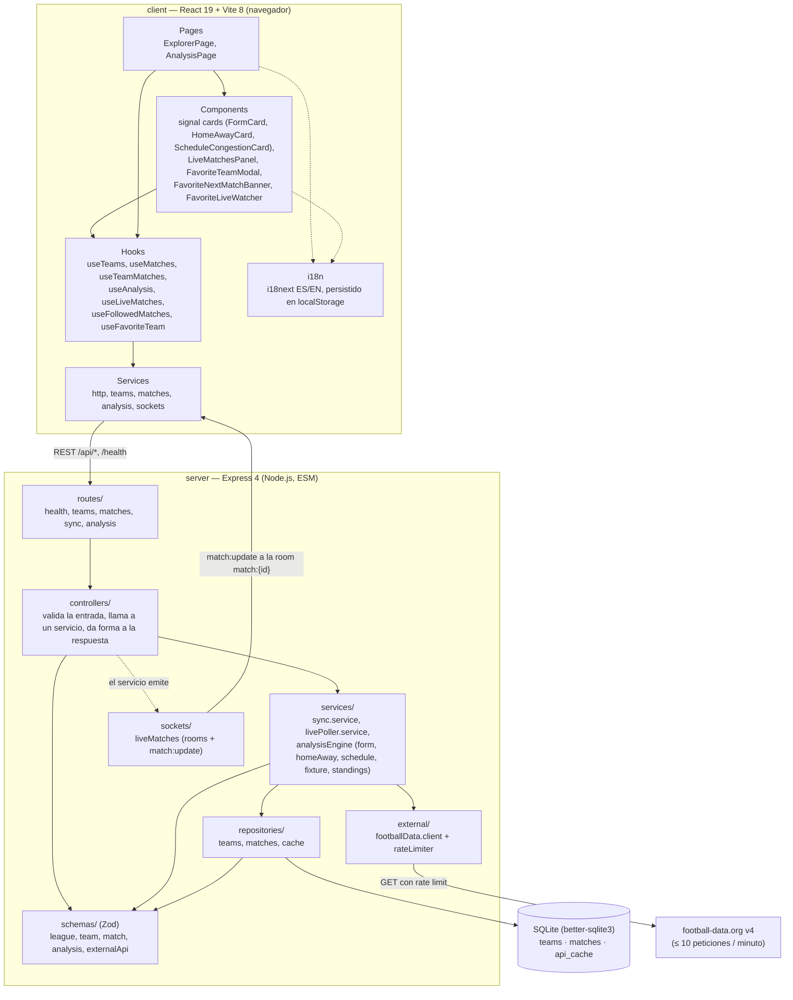

# Arquitectura

Vista por capas de Pre-match. El servidor mantiene un flujo de petición estricto —
`routes/` → `controllers/` → `services/` → `repositories/` — de modo que solo los repositorios
tocan SQL y solo `external/` habla con football-data.org. El cliente refleja esa misma disciplina
con páginas, componentes, hooks y servicios, donde los componentes nunca llaman a `fetch` ni a
`socket.io-client` directamente.

El servidor está dividido para que la app de Express se pueda importar sin abrir un puerto:
`src/app.js` construye la app y `src/server.js` es el único fichero que crea el servidor HTTP,
adjunta Socket.io y arranca el poller en vivo. La validación de dominio vive en schemas de Zod bajo
`src/schemas/`, y cada payload externo se parsea con ellos antes de que el resto del backend confíe
en él.

## Capas y responsabilidades

| Capa | Ubicación | Responsabilidad |
| --- | --- | --- |
| Routes | `server/src/routes/` | Mapean verbos HTTP y rutas a controllers. Sin lógica. |
| Controllers | `server/src/controllers/` | Validan la petición (Zod), llaman a un service o repository, dan forma a la respuesta y delegan errores al middleware central. |
| Services | `server/src/services/` | Lógica de negocio: orquestación del sync, el poller en vivo y las tres señales independientes del motor de análisis más la resolución de fixture y la tabla de posiciones. |
| Schemas | `server/src/schemas/` | Schemas de Zod para el modelo de dominio y los payloads de football-data.org. |
| Repositories | `server/src/repositories/` | Los únicos módulos que conocen SQL y nombres de columna. Devuelven objetos planos en camelCase. |
| External | `server/src/external/` | Cliente REST de football-data.org y el rate limiter compartido. |
| Sockets | `server/src/sockets/` | Handlers de suscripción de Socket.io y la difusión por room de cada partido. |
| DB | `server/src/db/` | Conexión SQLite perezosa y el runner de migraciones (`db/migrations/*.sql`). |
| Pages | `client/src/pages/` | Orquestan hooks y navegación; sin llamadas de red. |
| Components | `client/src/components/` | Presentación: tarjetas de señales, panel en vivo, modal y banner de favorito. |
| Hooks | `client/src/hooks/` | Acceso a datos con estado y el contexto compartido del equipo favorito. |
| Services | `client/src/services/` | Wrappers puros de `fetch` / `socket.io-client`. |

## Persistencia

`teams` y `matches` son historial duradero; `api_cache` es efímera y guarda el JSON crudo de
football-data.org con un TTL (una hora para la lista de partidos de una liga). Las lecturas
posteriores al vencimiento se tratan como fallos de caché y se eliminan de forma perezosa. Las
claves foráneas de `matches` hacia `teams` se aplican en cada conexión.

## Diagramas detallados

- [Sincronización y caché](sync-and-cache.es.md): `POST /api/sync/:league`.
- [Motor de análisis](analysis-engine.es.md): `GET /api/analysis`.
- [Actualizaciones en vivo](live-updates.es.md): Socket.io más el poller acotado.
- [Equipo favorito](favorite-team.es.md): el contexto compartido y el ciclo de vida del modal.
