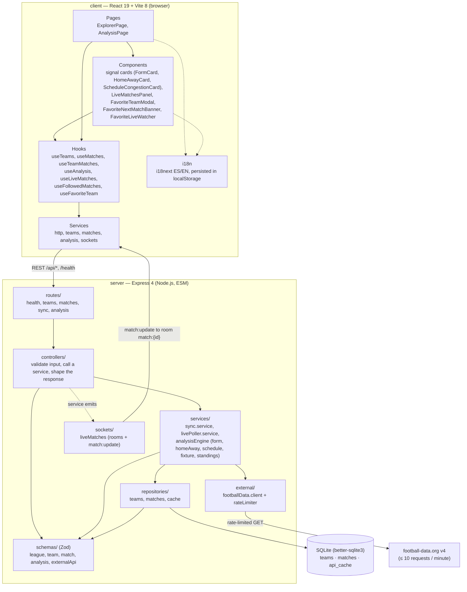

# Architecture

Layered view of Pre-match. The server keeps a strict request flow —
`routes/` → `controllers/` → `services/` → `repositories/` — so only the repositories
touch SQL and only `external/` talks to football-data.org. The client mirrors that discipline with
pages, components, hooks and services, where components never call `fetch` or
`socket.io-client` directly.

The server is split so the Express app can be imported without opening a port: `src/app.js` builds
the app and `src/server.js` is the only file that creates the HTTP server, attaches Socket.io and
starts the live poller. Domain validation lives in Zod schemas under `src/schemas/`, and every
external payload is parsed with them before the rest of the backend trusts it.

## Layers and responsibilities

| Layer | Location | Responsibility |
| --- | --- | --- |
| Routes | `server/src/routes/` | Map HTTP verbs and paths to controllers. No logic. |
| Controllers | `server/src/controllers/` | Validate the request (Zod), call one service or repository, shape the response and delegate errors to the central middleware. |
| Services | `server/src/services/` | Business logic: sync orchestration, the live poller and the analysis engine's three independent signals plus fixture resolution and standings. |
| Schemas | `server/src/schemas/` | Zod schemas for the domain model and the football-data.org payloads. |
| Repositories | `server/src/repositories/` | The only modules that know SQL and column names. Return plain camelCase objects. |
| External | `server/src/external/` | football-data.org REST client and the shared rate limiter. |
| Sockets | `server/src/sockets/` | Socket.io subscription handlers and the per-match room broadcast. |
| DB | `server/src/db/` | Lazy SQLite connection and the migration runner (`db/migrations/*.sql`). |
| Pages | `client/src/pages/` | Orchestrate hooks and navigation; no network calls. |
| Components | `client/src/components/` | Presentation: signal cards, live panel, favorite modal, banner. |
| Hooks | `client/src/hooks/` | Stateful data access and the shared favorite-team context. |
| Services | `client/src/services/` | Pure `fetch` / `socket.io-client` wrappers. |

## Persistence

`teams` and `matches` are durable history; `api_cache` is ephemeral and holds raw football-data.org
JSON with a TTL (one hour for a league's fixture list). Reads past the expiry are treated as misses
and lazily removed. Foreign keys from `matches` to `teams` are enforced on every connection.

## Detailed diagrams

- [Sync and cache](sync-and-cache.md): `POST /api/sync/:league`.
- [Analysis engine](analysis-engine.md): `GET /api/analysis`.
- [Live updates](live-updates.md): Socket.io plus the bounded poller.
- [Favorite team](favorite-team.md): the shared context and the modal lifecycle.
