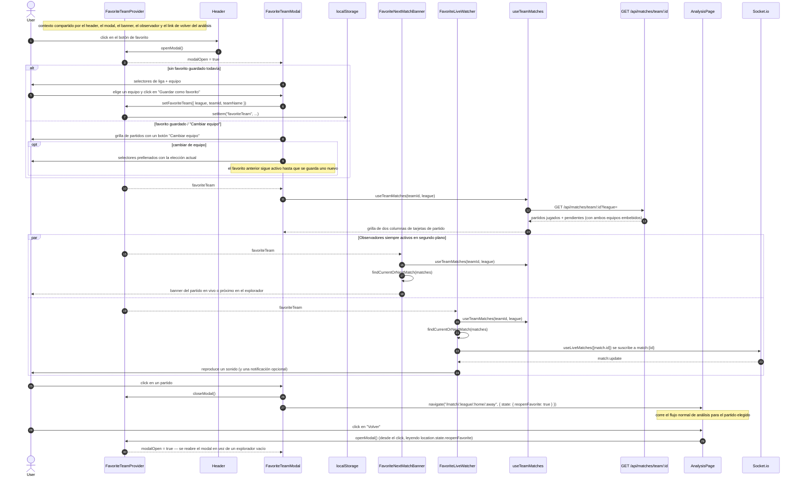

# Equipo favorito

El equipo favorito es una opción extra sobre el explorador, no una ruta. Un único contexto de React
(`FavoriteTeamProvider` en `hooks/useFavoriteTeam.js`) posee el equipo y el estado de
abierto/cerrado de su modal, así que el botón del header, el propio modal, el banner del explorador,
el observador en vivo y el link de "Volver" de la vista de análisis leen y cambian el mismo estado.
El equipo se persiste en `localStorage`; el estado del modal no.

Puntos clave:

- **Contexto compartido, no un hook por consumidor.** El estado del favorito debe ser idéntico
  para el botón del header, el modal, el banner, el observador y el link de volver del análisis,
  así que vive en un contexto en vez de instanciarse por separado en cada uno.
- **El almacenamiento es best-effort.** Cuando `localStorage` no está disponible (modo privado,
  cuota agotada), el provider degrada a un valor en memoria en vez de romper el render.
- **Auto-seguimiento.** `FavoriteLiveWatcher` se monta una sola vez en `AppShell`, no dentro de una
  página, así que el partido del equipo favorito se sigue sin importar la ruta activa. Suscribirse
  a un partido que todavía no arrancó es inofensivo: el servidor solo emite cuando entra en su
  ventana en vivo.
- **La navegación del banner es el flujo normal.** `FavoriteNextMatchBanner` navega sin
  `state.reopenFavorite`, así que "Volver" se comporta igual que desde cualquier link del
  explorador. Solo un partido abierto desde el modal activa ese flag.
- **Soporte de teclado.** El modal atrapa Tab/Shift+Tab dentro del panel y cierra con Escape, así
  el foco nunca se escapa hacia el explorador de fondo.
