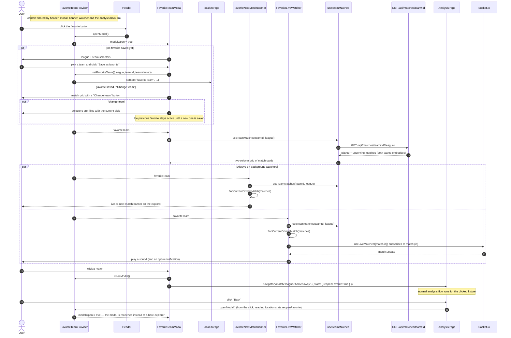

# Favorite team

The favorite team is an optional extra layered on top of the explorer, not a route. One React
context (`FavoriteTeamProvider` in `hooks/useFavoriteTeam.js`) owns the team and the open/closed
state of its modal, so the header button, the modal itself, the explorer banner, the live watcher
and the analysis page's back link all read and change the same state. The team is persisted in
`localStorage`; the modal state is not.

Key points:

- **Shared context, not a per-caller hook.** The favorite state must be identical for the header
  button, the modal, the banner, the watcher and the analysis back link, so it lives in one context
  rather than being instantiated separately by each consumer.
- **Storage is best-effort.** When `localStorage` is unavailable (private mode, quota), the provider
  degrades to an in-memory value instead of breaking the render.
- **Auto-follow.** `FavoriteLiveWatcher` is mounted once in `AppShell`, not inside a page, so the
  favorite team's match is followed regardless of the active route. Subscribing to a match that has
  not started yet is harmless: the server only emits once it enters its live window.
- **Banner navigation is the normal flow.** `FavoriteNextMatchBanner` navigates without
  `state.reopenFavorite`, so "Back" behaves like it does from any explorer link. Only a match opened
  from the modal sets that flag.
- **Keyboard support.** The modal traps Tab/Shift+Tab inside the panel and closes on Escape, so
  focus never leaks to the explorer underneath.
