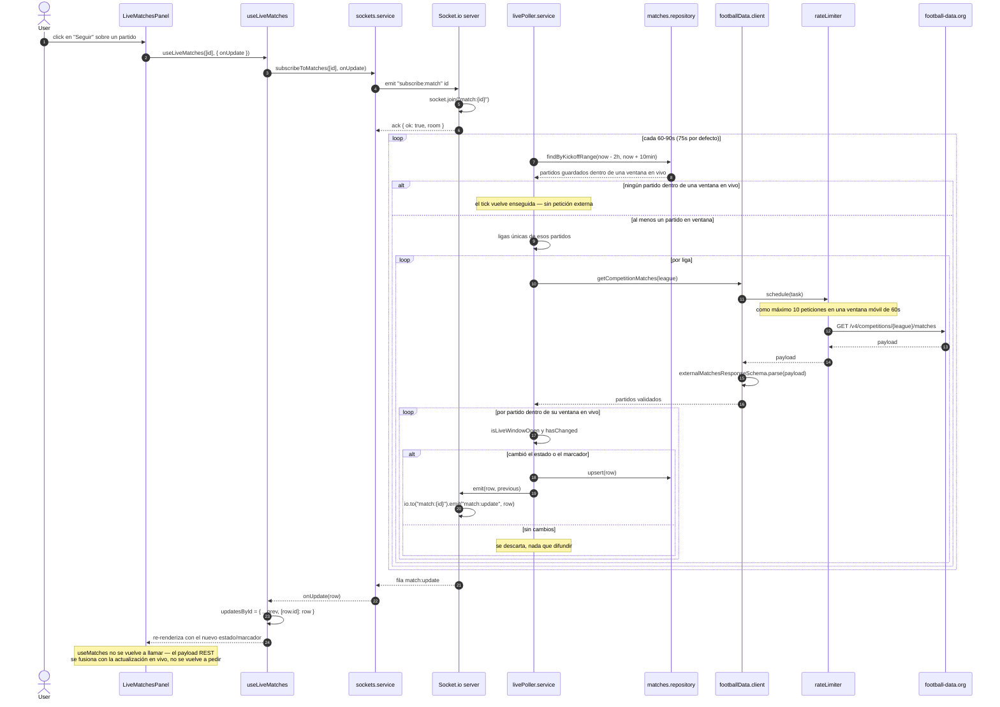

# Actualizaciones en vivo

Tiempo real de punta a punta. El cliente se suscribe a los partidos que sigue vía Socket.io; un
poller independiente en el servidor solo llama a football-data.org mientras un partido guardado está
dentro de su ventana en vivo (kickoff - 10 min → kickoff + 2 h). Los cambios detectados se persisten
y se difunden a la room del partido, y el cliente fusiona la actualización en la fila renderizada sin
volver a pedir la lista.

Puntos clave:

- Cada partido es una room (`match:{id}`), así que un suscriptor solo recibe eventos de los
  partidos que pidió. Los eventos `subscribe:match` / `unsubscribe:match` aceptan un ack opcional
  con `{ ok: true, room }` o `{ ok: false }` para un id inválido.
- El polling está acotado a la ventana en vivo: sin ningún partido en juego, el poller no hace
  ninguna petición externa. Todas las peticiones pasan por el rate limiter compartido (≤ 10 por
  minuto).
- Que una liga falle (un corte de red, rate limit, payload inválido) nunca aborta las demás ligas
  del mismo tick — los fallos se aíslan por liga y se reportan vía `onError`.
- Solo se persisten y emiten los cambios de estado o marcador (`hasChanged`), así que un sondeo sin
  cambios queda en silencio.
- El mismo mecanismo alimenta el auto-seguimiento del equipo favorito: `FavoriteLiveWatcher` se
  suscribe al partido actual o próximo del equipo favorito y reproduce un sonido (más una
  notificación de escritorio opcional) en cada actualización.
