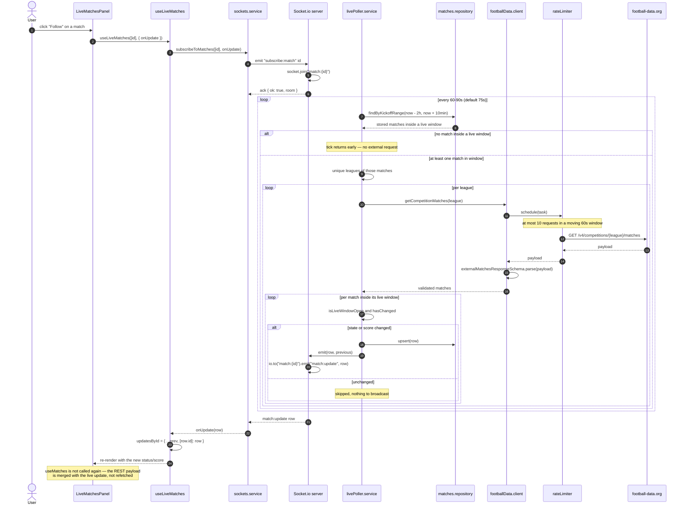

# Live updates

End-to-end real time. The client subscribes to the matches it follows over Socket.io; an independent
poller on the server only calls football-data.org while a stored match is inside its live window
(kickoff - 10 min → kickoff + 2 h). Detected changes are persisted and broadcast to the match's
room, and the client merges the update into the rendered row without refetching the list.

Key points:

- Each match is a room (`match:{id}`), so a subscriber only receives events for the matches it asked
  for. The `subscribe:match` / `unsubscribe:match` events accept an optional ack with
  `{ ok: true, room }` or `{ ok: false }` for an invalid id.
- Polling is bounded to the live window: with no match in play the poller performs no external
  request at all. All requests go through the shared rate limiter (≤ 10 per minute).
- A single league failing (network hiccup, rate limit, invalid payload) never aborts the other
  leagues in the same tick — failures are isolated per league and reported through `onError`.
- Only state or score changes are persisted and emitted (`hasChanged`), so an unchanged poll is
  silent.
- The same mechanism powers the favorite team's automatic follow-up: `FavoriteLiveWatcher` subscribes
  to the favorite team's current-or-next match and plays a sound (plus an opt-in desktop
  notification) on every update.
