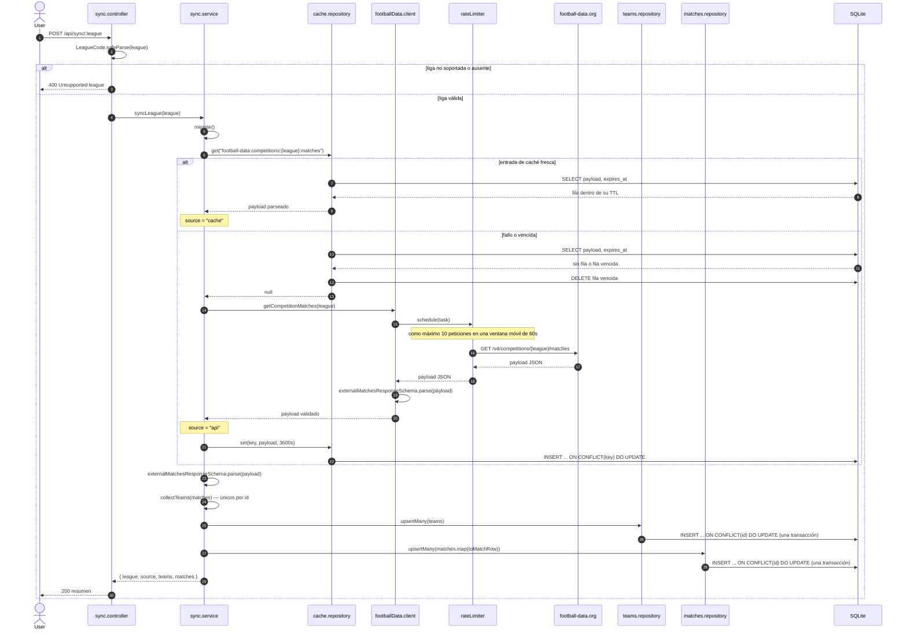

# Sincronización y caché

Secuencia de `POST /api/sync/:league`, el único camino de escritura para los datos de
football-data.org. Una liga se sirve desde la tabla `api_cache` cuando existe una entrada fresca; si
no, el cliente consulta football-data.org a través del rate limiter compartido. En ambos casos el
payload se valida con Zod al salir — los datos cacheados nunca se confían a ciegas — y luego se hace
upsert en `teams` y `matches`.

Puntos clave:

- La clave de caché es `football-data:competitions:{league}:matches`, con un TTL de una hora
  (`SYNC_TTL_SECONDS`).
- Solo se cachea una consulta de red; un acierto de caché igual se revalida y se vuelve a hacer
  upsert, así que un payload guardado que ya no coincide con el schema falla ruidosamente en vez de
  envenenar la base de datos en silencio.
- `teams` y `matches` se escriben cada una en una sola transacción vía `better-sqlite3`, indexadas
  por el id de football-data.org, así que re-sincronizar actualiza filas en su lugar en vez de
  duplicarlas.
