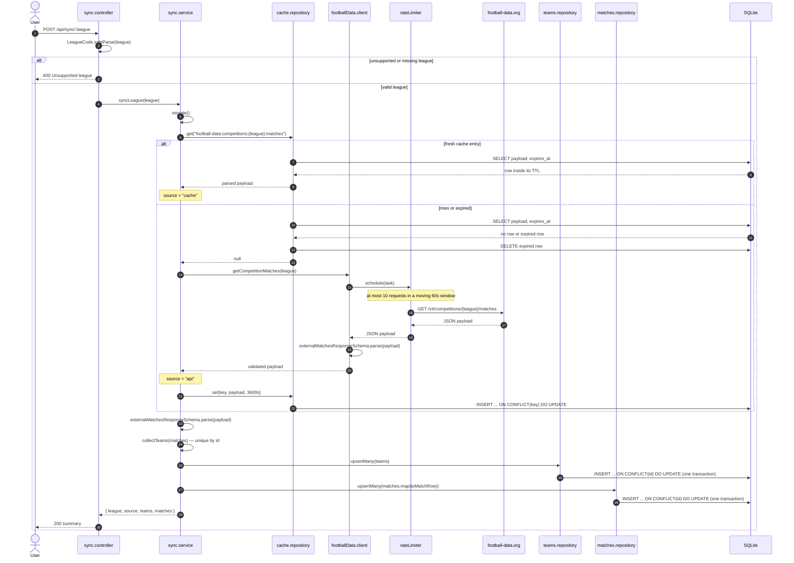

# Sync and cache

Sequence of `POST /api/sync/:league`, the only write path for football-data.org data. A league is
served from the `api_cache` table when a fresh entry exists; otherwise the client fetches from
football-data.org through the shared rate limiter. Either way the payload is validated with Zod on
the way out — cached data is never trusted blindly — and then upserted into `teams` and `matches`.

Key points:

- The cache key is `football-data:competitions:{league}:matches`, with a TTL of one hour
  (`SYNC_TTL_SECONDS`).
- Only a network fetch is cached; a cache hit is still re-validated and re-upserted, so a stored
  payload that no longer matches the schema fails loudly instead of silently poisoning the database.
- `teams` and `matches` are written in a single transaction each via `better-sqlite3`, keyed on the
  football-data.org id, so re-syncing updates rows in place instead of duplicating them.
